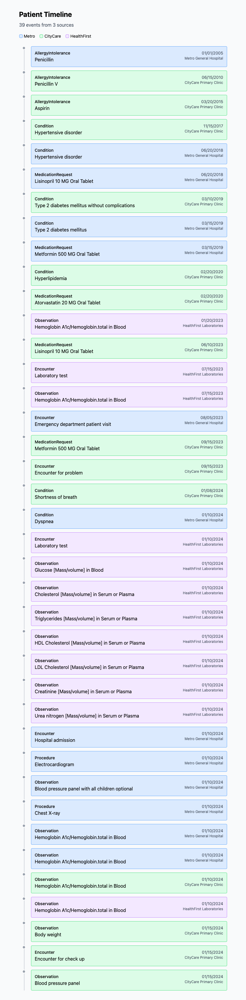

# Patient Timeline Visualization Challenge

## Overview

When patients receive care from multiple healthcare providers, their health data becomes fragmented across different Electronic Health Record (EHR) systems. Each system may record the same information differently, leading to inconsistencies, duplicates, and conflicts that can impact patient safety and care quality.

**Your task:** Build a patient timeline visualization that presents a unified, coherent view of a patient's health history by reconciling records from multiple sources.

## The Problem

You are given FHIR Bundle exports from three different healthcare systems for the same patient:

| System | Type | File |
|--------|------|------|
| Metro General Hospital | Hospital EHR | `data/fhir-exports/metro-general-hospital.json` |
| CityCare Primary Clinic | Ambulatory EHR | `data/fhir-exports/citycare-clinic.json` |
| HealthFirst Laboratories | Lab System | `data/fhir-exports/healthfirst-labs.json` |

The data contains realistic inconsistencies that occur in real-world healthcare scenarios.

### Example Conflict

Here's one conflict you'll find in the data:

> **Hypertension** is recorded with onset date **2018-06-20** at Metro General Hospital, but **2017-11-15** at CityCare Clinic—a 7-month discrepancy. Both records refer to the same condition (SNOMED code `38341003`), but the patient likely reported different dates at each facility.

Your task is to detect conflicts like this and present them clearly in the timeline.

## Requirements

Build a solution that:

1. **Parses** the three FHIR Bundle JSON files
2. **Identifies and reconciles conflicts** between the records, including:
   - Conditions with conflicting onset dates or verification status
   - Medications with different doses across systems
   - Lab results with value discrepancies
   - Allergies with different severity or reaction details
   - Data present in one system but missing from others
3. **Visualizes a unified patient timeline** that presents a coherent view of the patient's health history

### Output

Your solution should produce:
- A visual timeline showing the patient's health events in chronological order
- Clear indication of conflicts detected (e.g., tooltips, annotations, or a separate summary)
- Differentiation between data sources where relevant

### Example Output

Here's an example of how a conflict might be displayed in a timeline:

```
┌─────────────────────────────────────────────────────────────────┐
│ ⚠️ Hypertension                                      2017-2018  │
│                                                                 │
│ Conflict: Onset date differs between sources                    │
│   • CityCare Clinic: Nov 15, 2017                               │
│   • Metro General Hospital: Jun 20, 2018                        │
│                                                                 │
│ Both sources agree: Active condition, SNOMED 38341003           │
└─────────────────────────────────────────────────────────────────┘
```

This is just one approach—feel free to design your own UI for displaying conflicts.

### Technology

- Use any programming language or framework you prefer
- A starter Next.js project is provided in `examples/nextjs/` if you'd like to use it
- You may use any libraries for FHIR parsing, visualization, etc.

### Matching Logic

To identify the same record across systems, use the standardized codes in the `coding` arrays:
- **Conditions**: SNOMED CT codes (`http://snomed.info/sct`)
- **Medications**: RxNorm codes (`http://www.nlm.nih.gov/research/umls/rxnorm`)
- **Lab Results**: LOINC codes (`http://loinc.org`)
- **Allergies**: RxNorm codes for medication allergies

## Tools & Evaluation

We encourage you to use all available tools to complete this assignment, including AI coding assistants and agents. This reflects how we work in practice.

However, you will be evaluated on the overall result—including:
- **Visualization Quality**: Is the timeline clear and useful?
- **Conflict Resolution**: Are discrepancies handled intelligently?
- **Code Quality**: Is the code well-organized and maintainable?
- **Decision Making**: How did you handle ambiguous cases? What assumptions did you make?

Using AI tools effectively is a skill; the output still needs to meet our engineering standards.

## Deliverables

1. **A working timeline visualization** that reconciles data from all three sources
2. **A brief writeup** (can be in a README or separate file) addressing:
   - How to run your solution
   - How you approached conflict resolution
   - Key design decisions and assumptions
   - What you would improve with more time

## Time Expectation

We expect this to take **3-5 hours**. Focus on a working solution first; polish if time permits.

## Getting Started

The data files are in `data/fhir-exports/`. We provide starter projects in two languages:

### Next.js (TypeScript)

```bash
cd examples/nextjs
npm install
npm run dev
```

### Python (FastAPI)

```bash
cd examples/python
python -m venv .venv
source .venv/bin/activate
pip install -r requirements.txt
python main.py
```

Both examples include:
- Data loading utilities
- Timeline event extraction
- A basic timeline visualization

The examples combine events chronologically but do **not** handle conflicts or reconciliation—you'll see duplicate entries and inconsistencies. You're free to build on either example, start fresh, or use a completely different tech stack.

## FHIR Resources Reference

If you're not familiar with FHIR, here are the key resources used:

- **Patient**: Demographics (name, DOB, contact info)
- **Condition**: Diagnoses with onset dates and status
- **MedicationRequest**: Prescriptions with dosing
- **Observation**: Lab results and vital signs with values
- **AllergyIntolerance**: Allergies with reactions and severity
- **Encounter**: Healthcare visits with dates and reasons

Each resource has a `meta.source` field indicating which system it came from.

For more details: [FHIR R4 Documentation](https://hl7.org/fhir/R4/)

## Useful Libraries

### JavaScript/TypeScript
- **[@types/fhir](https://www.npmjs.com/package/@types/fhir)** - TypeScript definitions for FHIR R4 resources
- **[fhirpath.js](https://github.com/HL7/fhirpath.js)** - JavaScript implementation of FHIRPath for querying FHIR data

### Python
- **[fhir.resources](https://github.com/nazrulworld/fhir.resources)** - Pydantic-based models for all FHIR resources with built-in validation

### Other Resources
- [Official FHIR R4 Specification](https://hl7.org/fhir/R4/)
- [FHIR R4 Resource List](https://hl7.org/fhir/R4/resourcelist.html)

## Questions?

If you have questions about the requirements, make a reasonable assumption and document it in your writeup.

---

## Starter Project Screenshot

Here's what the starter project looks like before conflict detection is implemented:


